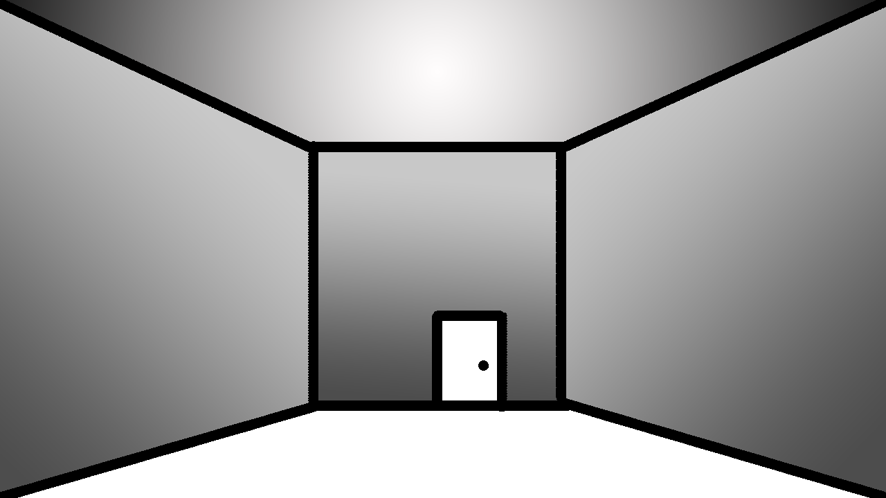

- Not getting a star
- Allegory for academic pressure
- Social test genre
- Monochrome, drawn, simplistic
- Quiet classroom, scratching of pencils
- Stationary character 360 view
- Simple 3d shapes
- Drawn "filter" to make rendering feel cooler
- Based on AP Calculus questions

The player stands in a long hallway, with a single door at the end. A single strip of lighting attached to the ceiling of the center of the hall illuminates the room. The hallway is completely white with simple shadows cast by the spherical lighting. A prompt guides the player through basic movement controls. WASD to move, [] to interact. 

Once the player has advanced to simple outline of a door and interacted with it, it swings open and the scene blacks out to render the next area.

The second room is a square classroom with a lower ceiling. It is lined with rows of desks, 4 rows of five desks along the back half of the room. In the front of the room, a single extra desk stands out with an indicator for the player to move towards it. The front wall of the room features a blank whiteboard and simple podium to the left of the entrance at the back of the room. 

Once the player moves close enough to the extra desk, a fade is used and the camera is snapped into free look from the perspective of the sitting player, but movement controls are disabled.

Lerp is employed to bring the view of the camera to the desk, where a blank paper rests on the surface [and a pencil or similiar appartus lies next to it]. The view is now locked as well.

